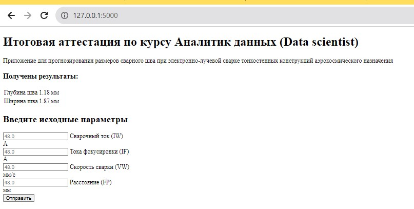

## Итоговый проект Токаревой Ирины Александровны
### Кейс «Прогнозирование размеров сварного шва при электронно-лучевой сварке тонкостенных конструкций аэрокосмического назначения»
Задача:
Используя результаты выполнения практического кейса «Прогнозирование размеров сварного шва при электронно-лучевой сварке тонкостенных конструкций аэрокосмического назначения» разработать приложение, цель которого прогнозирование ширины и глубины сварного соединения. Приложение может быть любым - консольным, web или GUI. Отчет должен содержать описание функционала приложения, руководство пользователя, демонстрацию работу.

**В качестве исходных данных в приложение необходимо ввести:**
1. Величину сварочного тока (IW).
2. Величину тока фокусировки электронного пучка (IF).
3. Скорость сварки (VW).
4. Расстояние от поверхности образцов до электронно-оптической системы (FP).
Далее программа рассчетает глубину и ширину шва.

Приложение запускается локально по ссылке: Running on http://127.0.0.1:5000/
 Для выхода из приложения нужно нажать CTRL+C.